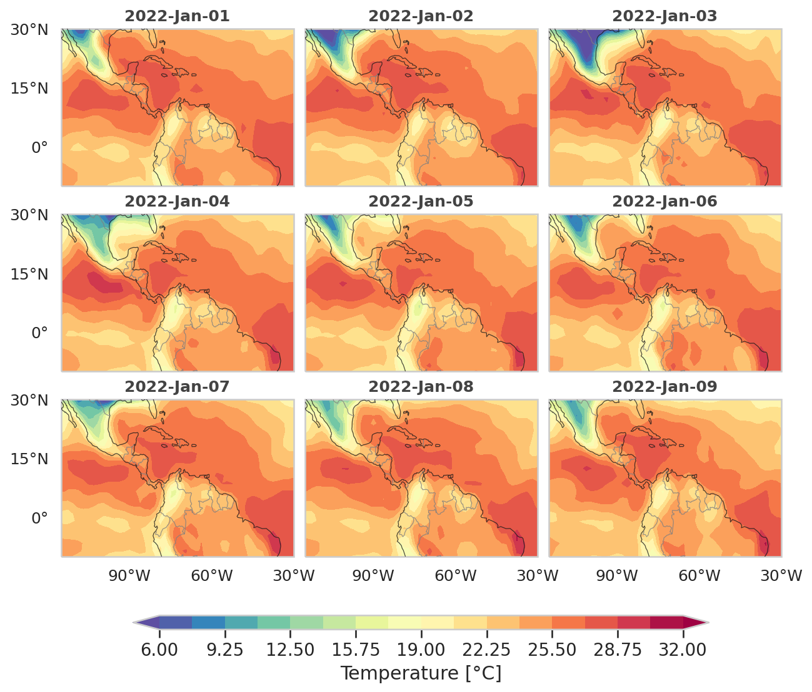
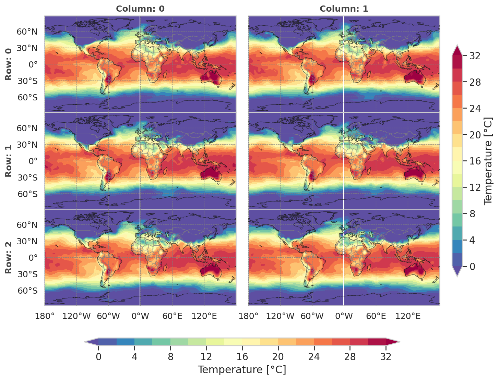

# Cartopy Grid Plots

This Python module, `cartopy_grid_plots.py`, is used for generating a grid of subplots in a single figure, each containing a geographic plot with temperature data. The grid of subplots can be customized to have any number of rows and columns. Each subplot includes features like continents, coastlines, and gridlines. The module uses the cartopy library for geographic data manipulation and plotting, and the xarray library for handling the netCDF dataset.

## Examples

The `cartopy_grid_plots` module generates highly customizable, grid-based geographic plots, as demonstrated in the examples below. These plots were produced using a surface temperature dataset from NCEP/DOE Reanalysis II. 

For step-by-step instructions on how to generate similar plots, please refer to the `tutorial.ipynb` notebook included in this repository.

## Functions
* `continentes_lon_lat(ax, lon_step=30, lat_step=15)`: This function adds continents, coastlines, gridlines, and tick labels to a Cartopy axes.

* `define_grid_fig(num_rows, num_columns, horiz_spacing=0.015, vert_spacing=0.05, **kwargs)`: This function calculates the coordinates and dimensions of the subplots in a grid figure.

* `add_colorbar(fig, cs, label, orientation, grid_prop, cbar_factor=0.8, cbar_width=0.025, **kwargs)`: This function adds a colorbar to a figure.

## Usage
To use this module, follow these steps:

1. Import the module into your Python script.
2. Define the dataset, map projection and set the image extent.
3. Define the grid size (number of rows and columns).
4. Use the `define_grid_fig` function to calculate properties of the grid.
5. Create a figure with a specified size.
6. Loop through each row and column to create a grid of subplots using the `continentes_lon_lat` function.
7. Set the image extent and aspect ratio of the plot.
8. Plot the dataset for each axes slice.
9. Define the orientation and label of the colorbar.
10. Add a colorbar to the figure using the `add_colorbar` function.

## Requirements
This module requires the following Python libraries:

* cartopy
* numpy
* matplotlib
* xarray
* pandas
* seaborn

License
This project is licensed under the MIT License - see the LICENSE.md file for details